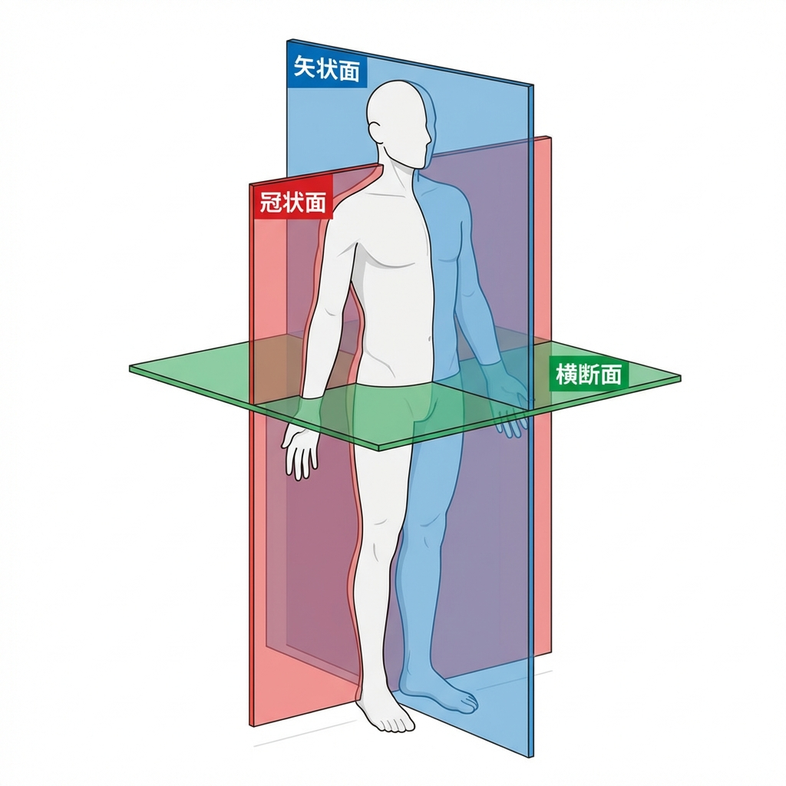

# 第1章：功能解剖学概述

## 学习目标
- 理解功能解剖学的基本概念和重要性
- 掌握标准解剖学姿势、解剖面与解剖轴的定义及应用
- 掌握常用的方位名词及其在临床中的定位作用
- 了解运动系统的基本组成并建立系统的学习框架

## 1.1 功能解剖学的定义与特点

### 定义
功能解剖学是从**运动功能**的角度研究人体解剖结构的学科，强调结构与功能的统一。

### 核心特点
- **功能视角**：不仅关注解剖结构，更关注结构如何实现功能
- **系统观点**：将多个结构视为一个整体运动系统
- **动态性**：强调运动时各结构的相互作用
- **临床相关性**：直接指导康复和运动评估

## 1.2 功能解剖学的发展历程

| 时期 | 主要贡献 | 代表人物 |
|------|---------|---------|
| 古代 | 解剖学基础建立 | 盖伦、维萨留斯 |
| 近代 | 生物力学研究 | 韦伯兄弟 |
| 现代 | 功能系统整合 | 布罗德本克 |
| 当代 | 循证康复 | 众多研究者 |

## 1.3 运动系统的基本组成

### 被动系统
- **骨骼系统**
  - 杠杆作用
  - 保护内脏
  - 储存矿物质

- **关节系统**
  - 关节面形状
  - 关节囊与韧带
  - 定义运动范围

- **韧带与筋膜**
  - 稳定性维持
  - 力量传递

### 主动系统
- **肌肉系统**
  - 产生力量
  - 控制运动
  - 维持姿态

### 神经控制系统
- **中枢神经系统**
  - 脑脊髓
  - 运动规划与控制

- **周围神经系统**
  - 神经根分布
  - 感觉运动整合

## 1.4 标准解剖学方位与参考体系

### 1.4.1 解剖学姿势 (Anatomical Position)

解剖学姿势是描述人体所有结构位置的**基准状态**：
- 身体直立，面向正前方。
- 双眼平视，双足并拢，足尖朝前。
- 上肢自然下垂于躯干两侧，**掌心朝前**。

**临床意义**：在康复应用中，此姿势为各关节的**中立位（0度位）**。无论人体由于活动或环境如何改变姿态，描述其结构关系时必须以此为统一标准。

### 1.4.2 常用方位名词 (Directional Terms)
解剖学家定义了确定的方位术语，以消除因姿态变化（如倒立或平卧）带来的描述混乱：
- **上 (Superior) / 下 (Inferior)**：靠近头部为上，靠近足部为下。
- **前 (Anterior) / 后 (Posterior)**：靠近腹侧为前，靠近背侧为后。
- **内侧 (Medial) / 外侧 (Lateral)**：靠近正中矢状面为内侧，远离为外侧。
- **内 (Internal) / 外 (External)**：主要针对有腔器官，靠近腔内为内，靠近表面为外。
- **深 (Deep) / 浅 (Superficial)**：以皮肤为准，深入体内为深，靠近表面为浅。
- **近侧 (Proximal) / 远侧 (Distal)**：用于四肢，靠近躯干为近侧，远离躯干为远侧。
- **肢体特有术语**：
    - 上肢：**尺侧**（相当于内侧）、**桡侧**（相当于外侧）。
    - 下肢：**胫侧**（相当于内侧）、**腓侧**（相当于外侧）。

### 1.4.3 解剖面 (Anatomical Planes)
描述运动方向的三维虚拟平面：
1. **矢状面 (Sagittal plane)**：将身体分为左右两部。**正中矢状面**将身体平分为对称的左右两部分。
2. **冠状面/额状面 (Coronal/Frontal plane)**：将身体分为前后两部。
3. **横断面/水平面 (Transverse plane)**：将身体分为上下两部，与地面平行。

### 1.4.4 解剖轴 (Anatomical Axes)
描述关节转动的三条虚拟轴，彼此相互垂直：
- **矢状轴 (Sagittal axis)**：前后走向。由矢状面与横断面相交而成。
- **冠状轴 (Frontal axis)**：左右走向。由冠状面与横断面相交而成。
- **垂直轴 (Vertical axis)**：上下走向。由矢状面与冠状面相交而成。

### 1.4.5 在关节运动描述中的应用
理解平面、轴与运动形式的对应关系是功能解剖学的核心：

| 解剖面 | 对应轴 | 主要运动形式 | 临床/运动举例 |
| :--- | :--- | :--- | :--- |
| **矢状面** | **冠状轴** | 屈、伸 (Flexion/Extension) | 膝关节弯曲、下蹲、脊柱前屈 |
| **冠状面** | **矢状轴** | 外展、内收 (Abduction/Adduction) | 侧平举、髋关节外摆、脊柱侧弯 |
| **横断面** | **垂直轴** | 旋转 (Rotation) | 躯干扭转、肩关节旋内外、芭蕾舞旋转 |

## 1.5 功能解剖学的研究方法

### 体表解剖标志法
- 触诊重要骨性标志（如肩峰、髂前上棘）
- 确定关键肌肉位置

### 影像学方法
- X线片：观察骨骼排列与关节间隙
- CT/MRI：观察肌肉、韧带等软组织细节
- 超声：实时动态观察肌肉收缩与骨骼滑动

### 生物力学分析
- 力矩与杠杆平衡计算
- 关节反力分析
- 运动学参数（位移、速度、加速度）测定

### 电生理学方法
- 肌电图（EMG）：反映肌肉激活的时序与强度
- 神经传导速度监测

## 1.6 功能解剖学在临床中的应用

### 诊断与评估
- 识别异常运动模式（如圆肩、扣膝）
- 定位功能障碍源（肌肉无力或关节受限）
- 评估代偿策略

### 治疗设计
- 针对性运动处方（针对薄弱环节）
- 优化运动技巧
- 预防再次损伤

### 运动员培训
- 提升运动表现
- 降低损伤风险
- 个性化训练设计

## 要点总结

✓ 功能解剖学强调**结构-功能统一**
✓ 运动系统由**被动、主动和神经**三部分组成
✓ **标准解剖学姿势、平面与轴**是描述人体运动的国际通用语言
✓ 关节运动总是围绕**垂直于该平面的轴**进行

## 复习思考题

1. 为什么在描述人体结构时必须首先定义标准解剖学姿势？
2. 请列举上肢和下肢特有的方位名词，并说明它们分别对应内侧还是外侧。
3. 描述一个“向前踢腿”的动作，该动作发生在哪个平面？围绕哪条轴？
4. 功能解剖学在临床康复评估中扮演着怎样的角色？

## 推荐阅读与资源

- [Cardinal Planes and Axes of Movement - Physiopedia](https://www.physio-pedia.com/Cardinal_Planes_and_Axes_of_Movement)
- [Anatomical Planes and Axes - Tom Morrison Blog](https://tommorrison.uk/blog/anatomical-planes)
- [Anatomical Terms of Motion - Wikipedia](https://en.wikipedia.org/wiki/Anatomical_terms_of_motion)

---
